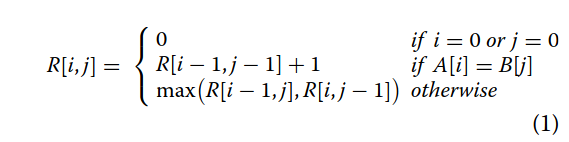
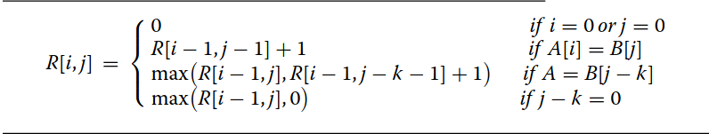
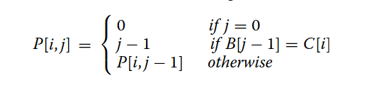
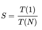
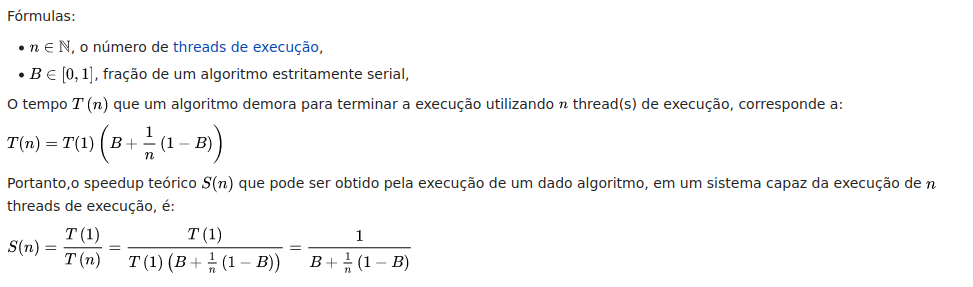

# Relatório Trabalho 1 OpenMP
Aluno: Leonardo Bueno Nogueira Kruger
GRR20180130

[github projeto](https://github.com/krugerleo/Parallel-computing)
## 1. Introdução
Trabalho sobre a paralelização do Algoritmo LCS (Longest Common Subsequence) utilizando OpenMPI, e a variação do método LCS em Row‑wise independent algorithm. O projeto completo com arquivos de entrada e script utilizado na execução dos resultados estão no github do projeto.
## 2. Funcionamento Core LCS
Algoritmo LCS (Longest Common Subsequence)
Algoritmo utilizado para encontrar a maior subsequencia presente em duas sequencias (Strings), uma subsequencia é caracteriza como uma sequência que aparece na mesma ordem relativa mas não necessariamente continua.

O Algoritmo trabalha em cima de uma matriz de tamanho sizeA x sizeB onde sizeA é o tamanho da string A e sizeB é o tamanho da string B, com a primeira linha e coluna inicializadas em 0.
```C
for (j = 0; j < (sizeA + 1); j++)
		scoreMatrix[0][j] = 0;

for (i = 1; i < (sizeB + 1); i++)
    scoreMatrix[i][0] = 0;
```
A partir dessa estrutura ocorre o LCS sobre a matriz, percorrendo a matriz caso encontre um 'match' de character (char de seqA e seqB correspondem) é pego o valor na diagonal anterior e somado 1 para o tamanho da subsequencia, caso contrario é maior valor do campo superior(cima) ou anterior(esquerda), ao final teremos o valor da maior subsequencia.
```C
int LCS(mtype ** scoreMatrix, int sizeA, int sizeB, char * seqA, char *seqB) {
	int i, j;
	for (i = 1; i < sizeB + 1; i++) {
		for (j = 1; j < sizeA + 1; j++) {
			if (seqA[j - 1] == seqB[i - 1]) {
				/* if elements in both sequences match,
				 the corresponding score will be the score from
				 previous elements + 1*/
				scoreMatrix[i][j] = scoreMatrix[i - 1][j - 1] + 1;
			} else {
				/* else, pick the maximum value (score) from left and upper elements*/
				scoreMatrix[i][j] =max(scoreMatrix[i-1][j], scoreMatrix[i][j-1]);
			}
		}
	}
	return scoreMatrix[sizeB][sizeA];
}
```
## 3. Estratégia de paralelização
A partir da estrutura core do LCS foi possível observar uma dependência de dados que impossibilitava a paralelização do código, a partir do aritgo [An OpenMP-based tool for finding longest
common subsequence in bioinformatics](https://bmcresnotes.biomedcentral.com/articles/10.1186/s13104-019-4256-6) que propõe soluções sobre problema, decidi por implementar a versão 1 proposta no artigo, Yang et al propõe o 'Row‑wise independent algorithm' uma solução diferente das tradicionais anti-diagonal e bit-parallel e a escolha para o meu trabalho.
O algoritmo consiste na modificação da equação tradicional do LCS:



Pela versão 'Row-wise':

Onde k é o numero de passos necessarios para encontrar uma match como seqA[i] == seqB[j-k] ou j-k == 0, para isso é utilizada outra matriz on calculamos os valores de j-k para toda iteração i, dado por:


A matriz de pontuação é separada em pedaços de acordo com o número de processos e executado o LCS de acordo com calculos demonstrados.
```C
int lcsMPI(short **scoreMatrix, short *P, char *A, char *B, char *C, int m, int n, int u, int myrank, int chunk_size)
{

    for (int i = 1; i < m + 1; i++)
    {
        int c_i = get_index_of_character(C, A[i - 1], u);

        short scoreMatrix_i_receive[chunk_size];

        MPI_Scatter(scoreMatrix[i], chunk_size, MPI_SHORT, &scoreMatrix_i_receive, chunk_size, MPI_SHORT, 0, MPI_COMM_WORLD);
        int start_id = (myrank * chunk_size);
        int end_id = (myrank * chunk_size) + chunk_size;
        for (int j = start_id; j < end_id; j++) // if myrank=0 then j=start_id+1 else j=start_id
        {
            if (j == start_id && myrank == 0)
                j = j + 1;
            if (A[i - 1] == B[j - 1])
            {
                scoreMatrix_i_receive[j - start_id] = scoreMatrix[i - 1][j - 1] + 1;
            }
            else if (P[(c_i * (n + 1)) + j] == 0)
            {
                scoreMatrix_i_receive[j - start_id] = max(scoreMatrix[i - 1][j], 0);
            }
            else
            {
                scoreMatrix_i_receive[j - start_id] = max(scoreMatrix[i - 1][j], scoreMatrix[i - 1][P[(c_i * (n + 1)) + j] - 1] + 1);
            }
        }
        // Junta em todos os processos
        MPI_Allgather(scoreMatrix_i_receive, chunk_size, MPI_SHORT, scoreMatrix[i], chunk_size, MPI_SHORT, MPI_COMM_WORLD);
    }
    return scoreMatrix[m - 1][n - 1];
}
```
Calculo da matriz P necessaria para remoção da dependência no LCS, a matrix é divida em pedaços para cada processo, os calculos permanecem os mesmos
```C
void calcPMatrix(short *P, char *b, int len_b, char *c, int len_c, int myrank, int chunk_size)
{
    char bufferToReceiveAlphabet[chunk_size];
    short bufferToReceivePmatrix[chunk_size * (len_b + 1)];
    // Send chunk
    MPI_Scatter(c, chunk_size, MPI_CHAR, &bufferToReceiveAlphabet, chunk_size, MPI_CHAR, 0, MPI_COMM_WORLD);
    // Send chunk
    MPI_Scatter(P, chunk_size * (len_b + 1), MPI_SHORT, &bufferToReceivePmatrix, chunk_size * (len_b + 1), MPI_SHORT, 0, MPI_COMM_WORLD);
    // Broadcast B
    // max throughput
    MPI_Bcast(b, len_b, MPI_CHAR, 0, MPI_COMM_WORLD);

    for (int i = 0; i < chunk_size; i++)
    {
        for (int j = 2; j < len_b + 1; j++)
        {
            if (b[j - 2] == bufferToReceiveAlphabet[i]) // j-2 as b we assume here that b has a empty character in the beginning
            {
                bufferToReceivePmatrix[(i * (len_b + 1)) + j] = j - 1;
            }
            else
            {
                bufferToReceivePmatrix[(i * (len_b + 1)) + j] = bufferToReceivePmatrix[(i * (len_b + 1)) + j - 1];
            }
        }
    }

    // Juntar contrario do scatter
    MPI_Allgather(bufferToReceivePmatrix, chunk_size * (len_b + 1), MPI_SHORT, P, chunk_size * (len_b + 1), MPI_SHORT, MPI_COMM_WORLD);
}
```
## 4. Informações e Metologia de testes
| Informação           | Descrição                                                                                       |
| -------------------- | ----------------------------------------------------------------------------------------------- |
| S.O/kernel cpu1      | Linux cpu1 5.10.0-17-amd64 #1 SMP Debian 5.10.136-1 (2022-08-13) x86_64 GNU/Linux               |
| S.O/kernel cpu2      | Linux cpu2 5.10.0-16-amd64 #1 SMP Debian 5.10.127-1 (2022-06-30) x86_64 GNU/Linux               |
| versão do compilador | gcc version 10.2.1 20210110 (Debian 10.2.1-6)                                                   |
| Flags de compilação  | -O3                                                                                             |
| Processador          | AMD EPYC 7401 24-Core Processor                                                                 |
| Número de execuções  | 20                                                                                              |
| Metodologia          | Teste de escalabilidade                                                                         |
| Memoria RAM          | 200 GB (Não encontrei a frequência )                                                            |
| Compilar             | mpicc mpiKruger.c -o kruger                                                                     |
| parametros           | Recebe como entrada o caminho para Sequencia1, Sequencia2 e alphabeto presente                  |
| execuções            | mpirun --hostfile hosts.txt -np 2 kruger entradas/fileA.in entradas/fileB.in entradas/uniqAB.in |

#### Arquitetura processadores
```
Arquitetura:                     x86_64
Modo(s) operacional da CPU:      32-bit, 64-bit
Ordem dos bytes:                 Little Endian
Tamanhos de endereço:            48 bits physical, 48 bits virtual
CPU(s):                          32
Lista de CPU(s) on-line:         0-31
Thread(s) per núcleo:            1
Núcleo(s) por soquete:           8
Soquete(s):                      4
Nó(s) de NUMA:                   1
ID de fornecedor:                AuthenticAMD
Família da CPU:                  23
Modelo:                          1
Nome do modelo:                  AMD EPYC 7401 24-Core Processor
Step:                            2
CPU MHz:                         1999.995
BogoMIPS:                        3999.99
Virtualização:                   AMD-V
Fabricante do hipervisor:        KVM
Tipo de virtualização:           completo
cache de L1d:                    2 MiB
cache de L1i:                    2 MiB
cache de L2:                     16 MiB
cache de L3:                     64 MiB
CPU(s) de nó0 NUMA:              0-31
Opções:                          fpu vme de pse tsc msr pae mce cx8 apic sep mtrr pge mca cmov pat pse36 clflush mmx fxsr sse sse2 ht syscall nx mmxext fxsr_opt pdpe1gb rdtscp lm rep_good nopl cpuid extd_apicid 
                                 tsc_known_freq pni pclmulqdq ssse3 fma cx16 sse4_1 sse4_2 x2apic movbe popcnt tsc_deadline_timer aes xsave avx f16c rdrand hypervisor lahf_lm cmp_legacy svm cr8_legacy abm sse4a 
                                 misalignsse 3dnowprefetch osvw perfctr_core ssbd ibpb vmmcall fsgsbase tsc_adjust bmi1 avx2 smep bmi2 rdseed adx smap clflushopt sha_ni xsaveopt xsavec xgetbv1 xsaves clzero xsav
                                 eerptr virt_ssbd arat npt nrip_save arch_capabilities
```
## Check List
Aplicação paralela
- 1. Está correta? Algumas vezes retorna segfault?
- Sim, não retorna segfault, porém além de -np 5 o resultado não está correto
- 2. Tenho um N que roda em pelo menos 10s?
- Sim, porém pra valores altos o programa não apresentou consistencia.
- 3. Tenho tamanhos variados? (2N, 4N, 6N)
- Sim, 10k, 20k, 30k, 40k
Máquina
- 4. É um servidor virtualizado? Nem pense em rodar na amazon cloud.
- Sim, servidor virtualizado Dinf cpu1,cpu2, na servidora física orval os experimentos possuiam desvios muito grandes.
- 5. Estou usando modo usuário? Grub.
- Testes feitos em ambos os ambientes não demonstra variação


## 5. Resultados
### Tabelo de tempo serialXparalelo
| Tempo                      | Init Matrix Serial | LCS  Paralelo |
| -------------------------- | ------------------ | ------------- |
| MPI (NP 1)  40k            | 0.004419           | 4,778764      |
| Porcentagem do tempo total | 1%                 | 99%           |
### Argumento de amdahl
Tabela de amdahl dada por:
O argumento de Amdahl é utilizado para prever o máximo speedup teórico usando múltiplos processadores, a partir da porcentagem do programa paralelizavel.
A partir do speedup dado por:



temos as seguintes formulas, onde podemos obter o T(n) teoricamente e assim calcular o valor de S(n) em função do número de threads e da fração do algoritmo serial/paralelizavel. Através disso podemos montar a tabela teorica de Speedup.



No limite, como ‘'N" tende ao infinito, o speedup máximo tende ser 1 / (1 - P).
### Tabela Lei de Amdahl
| Lei de Amdahl      | 1   | 2    | 4    | 8    | N   |
| ------------------ | --- | ---- | ---- | ---- | --- |
| Eficiencia Teorica | 1   | 1,98 | 3,88 | 7,47 | 100 |


Resultados das execuções
Cada algoritmo foi executado pelo menos 20 vezes com as entradas dos tamanho descritos para coleta de dados e amostragem.
### Tabela Resultados
|                    | np 1     | np 2     | np 4     |
| ------------------ | -------- | -------- | -------- |
| Média em segs 10k: | 0,312181 | 0,420474 | 0,589554 |
| Desv Pad 10k:      | 0,0018   | 0,0109   | 0,0617   |
| Ḿédia/DesvPad:     | 0,0057   | 0,0259   | 0,1047   |
| Média em segs 20k: | 1,239316 | 1,407992 | 1,878533 |
| Desv Pad 20k:      | 0,0066   | 0,0491   | 0,2218   |
| Ḿédia/DesvPad:     | 0,0054   | 0,0349   | 0,1181   |
| Média em segs 30k: | 2,779283 | 2,976406 | 3,547244 |
| Desv Pad 30k:      | 0,0149   | 0,0980   | 0,3466   |
| Ḿédia/DesvPad:     | 0,0053   | 0,0329   | 0,0977   |
| Média em segs 40k: | 4,956067 | 5,074711 | 5,513934 |
| Desv Pad 40k:      | 0,0360   | 0,3071   | 0,4992   |
| Ḿédia/DesvPad:     | 0,0073   | 0,0605   | 0,0905   |
### Tabela Speedup
| procs      | 1 -> | 2 ->  | 4     |
| ---------- | ---- | ----- | ----- |
| Média 10k: | 1    | 0,742 | 0,530 |
| Média 20k: | 1    | 0,880 | 0,660 |
| Média 30k: | 1    | 0,934 | 0,784 |
| Média 40k  | 1    | 0,977 | 0,899 |
### Tabela Eficiência
| Eficiência | 1   | 2    | 4    |
| ---------- | --- | ---- | ---- |
| 10k        | 1   | 0,37 | 0,13 |
| 20k        | 1   | 0,44 | 0,16 |
| 30k        | 1   | 0,47 | 0,20 |
| 40k        | 1   | 0,49 | 0,22 |
## 6. Conclusão
Os resultados dos testes **não** satisfazem a expectativa de uma execução paralela mais rápida, comparando os resultados da tabela prática e da teórica demonstra uma grande discrepância dos valores. Possibilidades para o problema seria o custo da comunicação para o tamanho das amostras e má implementação do código.

Os testes mostraram o código implementado como funcional até 40K entradas e número de processos até 5, devido a essa limitação foi difícil a execução de mais testes de escalabilidade, os resultados demonstram uma melhoria de desempenho para entradas maiores, porém considero presunçoso afirmar escalabilidade fraca do código, mais testes e melhorias são necessários.

Comparado ao experimento anterior, o código não apresentou melhorias na versão paralela, porém foi possível a execução de testes mais precisos, com desvio padrão menores mesmo em servidor virtualizado do DINF baixando de 30% para no maior dos casos 11%.

