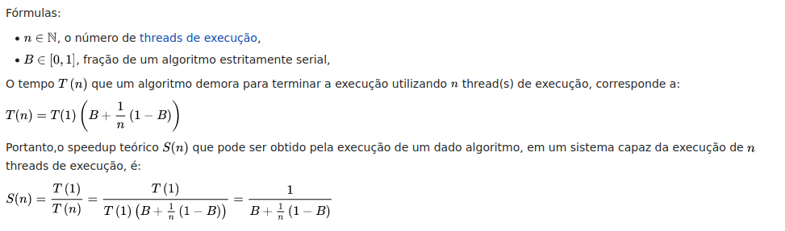
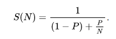

# Relatório Trabalho Final OpenMPI
Aluno: Leonardo Bueno Nogueira Kruger
GRR20180130

[github projeto](https://github.com/krugerleo/Parallel-computing)
## 1. Introdução
Trabalho sobre a paralelização do Algoritmo Laplace 2D utilizando OpenMPI. O projeto completo e script utilizado na execução dos resultados estão no github do projeto.
## 2. Funcionamento Laplace 2D
Laplace 2D
O algoritmo executa iterações sobre a matrix told incializada com zeros e com 100 nas bordas, efetuando o calculo do proximo valor da matrix a partir do Método de Diferença Central (estêncil de 5 pontos) e salvando em uma matrix auxiliar t.

```C
for (iter = 1; iter <= niter; iter++)
    {

        for (i = 1; i <= NRL; i++)
            for (j = 1; j <= NC; j++)
                t[i][j] = 0.25 * (told[i + 1][j] + told[i - 1][j] +
                                  told[i][j + 1] + told[i][j - 1]);
        dt = 0.;

        for (i = 1; i <= NRL; i++) /* Copy for next iteration  */
            for (j = 1; j <= NC; j++)
            {
                dt = MAX(abs(t[i][j] - told[i][j]), dt);
                told[i][j] = t[i][j];
            }

        /*------------------------*/
        /* Print some test values */
        /*------------------------*/

        if ((iter % 100) == 0)
        {
            if (mype == 0)
                printf("Iter = %4d: PE = %d: t[10][10] = %20.8f\n",
                       iter, mype, t[10][10]);
        }

    } /* End of iteration */
```
A partir do calculo do Método de Diferença Central (estêncil de 5 pontos) podemos ver uma dependencias entre a lianha anterior e a proxima, a coluna anterior e a proxima.
Tendo em vista que os valores são salvos em uma matrix t auxiliar e o calculo de um valor não depende do valor calculado anteriormete na mesma interação podemos paralelizar o código da seguinte maneira:

```C
    int chunk_size = NRL / num_procs;
    int start_index = chunk_size * my_rank + 1;
    int finish_index = chunk_size * (my_rank + 1);

    for (iter = 1; iter <= niter; iter++)
    {
        for (i = start_index; i <= finish_index; i++)
            for (j = 1; j <= NC; j++)
                t[i][j] = 0.25 * (told[i + 1][j] + told[i - 1][j] + told[i][j + 1] + told[i][j - 1]);

        dt = 0.;

        for (i = start_index; i <= finish_index; i++) /* Copy for next iteration  */
            for (j = 1; j <= NC; j++)
            {
                dt = MAX(abs(t[i][j] - told[i][j]), dt);
                told[i][j] = t[i][j];
            }
        MPI_Allgather(told[0], chunk_size, MPI_FLOAT, told[0], chunk_size, MPI_FLOAT, MPI_COMM_WORLD);
        /*------------------------*/
        /* Print some test values */
        /*------------------------*/

        if ((iter % 100) == 0 && my_rank == 0)
        {
            if (mype == 0)
                printf("Iter = %4d: PE = %d: t[10][10] = %20.8f\n",
                       iter, mype, t[10][10]);
        }

    } /* End of iteration */
    MPI_Finalize();
```
## 3. Estratégia de paralelização
A partir da estrutura core do Laplace 2d foi possível observar que não havia uma dependencia de dados direta entre o calculo dos proximos valores salvos em <i>t</i> a partir do método proposto. Como resultado foi possivel a distribuição do calculo dos valores sobre <i>told</i> entre os processos apenas utilizando calculos de chunk size para cada proceesso, agrupando e retransmitindo os resultados ao final.
```C

    int my_rank;
    int num_procs;
    MPI_Init(&argc, &argv);
    MPI_Comm_rank(MPI_COMM_WORLD, &my_rank);   // grab this process's rank
    MPI_Comm_size(MPI_COMM_WORLD, &num_procs); // grab the total num of processes
    int chunk_size = NRL / num_procs;
    int start_index = chunk_size * my_rank + 1;
    int finish_index = chunk_size * (my_rank + 1);

    for (iter = 1; iter <= niter; iter++)
    {
        for (i = start_index; i <= finish_index; i++)
            for (j = 1; j <= NC; j++)
                t[i][j] = 0.25 * (told[i + 1][j] + told[i - 1][j] + told[i][j + 1] + told[i][j - 1]);

        dt = 0.;

        for (i = start_index; i <= finish_index; i++) /* Copy for next iteration  */
            for (j = 1; j <= NC; j++)
            {
                dt = MAX(abs(t[i][j] - told[i][j]), dt);
                told[i][j] = t[i][j];
            }
        MPI_Allgather(told[0], chunk_size, MPI_FLOAT, told[0], chunk_size, MPI_FLOAT, MPI_COMM_WORLD);
        /*------------------------*/
        /* Print some test values */
        /*------------------------*/

        if ((iter % 100) == 0 && my_rank == 0)
        {
            if (mype == 0)
                printf("Iter = %4d: PE = %d: t[10][10] = %20.8f\n",
                       iter, mype, t[10][10]);
        }

    } /* End of iteration */
    MPI_Finalize();
```
## 4. Entre OpenMP e MPI é dito que o paradigma de programação se altera entre memória compartilhada e memória distribuída respectivamente. Explique sucintamente essa afirmação.
Os paradigmas de programação se alteram em memória compartilhada existe menos complexidade na comunicação entre processos, normalmente uma limitação maior no número de processos logo diminuição de complexidade. Já na memória distribuída a programação fica mais complexa tendo que trabalhar com sincronização de processos, comunicação de dados entre multicomputadores mas tras a possibilidade de maior expansão de processadores.
## 5. Considerando que seu computador possua P processadores, descreva os possíveis problemas (se houver) relacionados ao balanceamento de carga em utilizar um número P+P/2 de threads/processos.
Caso não haja suporte Multi-Threading nos Processadores pode ocorrer muita troca de contexto ocasionando overhead na execução do programa.

## 6. Considerando as técnicas de voltagem e frequência escalável dinâmica (dynamic voltage and frequency scaling) existentes nos processadores modernos, descreva os possíveis problemas (se houver) durante a estimativa de speedup.
A voltagem e frequência dinâmicas podem interferir na medição do tempo de execução do programa paralelo e serial, interferindo assim nos valores utilizados para a estimativa do speedup sobre a lei de ahmdal. 

## 7. Explique o que é Simultaneous Multi-Threading (SMT) utilizado nos processadores Intel, AMD e IBM.
1. Descreva duas situações onde duas threads executando em um
mesmo núcleo ganhariam desempenho com tal mecanismo.
R: Duas threads ganham desempenho caso não estejam executando tarefas que concorram aos recursos limitados do processador, como ULA ou Cache. Exemplo um programa que esteja fazendo calculos utilizando a ULA e um programa que esteja fazendo transmissão de dados, nesse caso não existe disputa pela ULA
1. Descreveva duas situações onde duas threads executando em
um mesmo núcleo poderiam perder desempenho com tal
mecanismo.
R: Duas threads perdem desempenho caso estejam executando tarefas que concorrem aos recursos limitados do processador, como ULA ou Cache. Exemplo dois programas que fazem muita leitura de dados podem sobreescrever os dados da cache prejudicando ambas as execuções, ou dois programas que necessitem da mesma ULA para calculo são prejudicados.
3. Sabendo que GPU’s utilizam Interleaved Multi-threading (IMT),
descreva a diferença entre IMT e SMT.
R: IMT executa intrução de uma thread por ciclo, SMT executa intruções de mais de uma thread por cicle utilizando melhor a capacidade dos recursos do processador

## 6. Informações e Metologia de testes
| Informação           | Descrição                                                                                                               |
| -------------------- | ----------------------------------------------------------------------------------------------------------------------- |
| S.O/kernel           | Linux kruger-Ubuntu 5.15.0-48-generic #54~20.04.1-Ubuntu SMP Thu Sep 1 16:17:26 UTC 2022 x86_64 x86_64 x86_64 GNU/Linux |
| versão do compilador | gcc version 9.4.0 (Ubuntu 9.4.0-1ubuntu1~20.04.1)                                                                       |
| Flags de compilação  | -O3                                                                                                                     |
| Processador          | AMD Ryzen 5 4500 6-Core Processor                                                                                       |
| Número de execuções  | 20,  Testes feitos em sistema isolado da rede e apenas execução do laplace.                                             |
| Metodologia          | Teste de escalabilidade fraca e forte.                                                                                  |
| Memoria RAM          | 16 GB ddr4 3000mhz                                                                                                      |
| Compilar             | mpicc mpiLaplace2d.c -o kruger -O3                                                                                      |
| Executar             | mpirun kruger                                                                                                           |


#### Arquitetura processadores
```
Arquitetura:                     x86_64
Modo(s) operacional da CPU:      32-bit, 64-bit
Ordem dos bytes:                 Little Endian
Address sizes:                   48 bits physical, 48 bits virtual
CPU(s):                          12
Lista de CPU(s) on-line:         0-11
Thread(s) per núcleo:            2
Núcleo(s) por soquete:           6
Soquete(s):                      1
Nó(s) de NUMA:                   1
ID de fornecedor:                AuthenticAMD
Família da CPU:                  23
Modelo:                          96
Nome do modelo:                  AMD Ryzen 5 4500 6-Core Processor
Step:                            1
Frequency boost:                 enabled
CPU MHz:                         438.080
CPU MHz máx.:                    4208,0000
CPU MHz mín.:                    400,0000
BogoMIPS:                        7186.35
Virtualização:                   AMD-V
cache de L1d:                    192 KiB
cache de L1i:                    192 KiB
cache de L2:                     3 MiB
cache de L3:                     8 MiB
CPU(s) de nó0 NUMA:              0-11
```

## Check List
Aplicação paralela
- 1. Está correta? Algumas vezes retorna segfault?
- Sim, não retorna segfault.
- 2. Tenho um N que roda em pelo menos 10s?
- Sim.
- 3. Tenho tamanhos variados? (2N, 4N, 6N)
- Sim, 5k, 10k
- 4. É um servidor virtualizado? Nem pense em rodar na amazon cloud.
- Não.
- 5. Estou usando modo usuário? Grub.
- Sim.


## 5. Resultados
### Tabelo de tempo serialXparalelo
| Tempo                      | Inicialização | Laplace  Paralelo |
| -------------------------- | ------------- | ----------------- |
| MPI (NP 1)  5k             | 0.014077      | 6.445938          | ; |
| Porcentagem do tempo total | 0.22%         | 99.78%            |
### Argumento de amdahl
Tabela de amdahl dada por:
O argumento de Amdahl é utilizado para prever o máximo speedup teórico usando múltiplos processadores, a partir da porcentagem do programa paralelizavel.
A partir do speedup dado por:


temos as seguintes formulas, onde podemos obter o T(n) teoricamente e assim calcular o valor de S(n) em função do número de threads e da fração do algoritmo serial/paralelizavel. Através disso podemos montar a tabela teorica de Speedup.





No limite, como ‘'N" tende ao infinito, o speedup máximo tende ser 1 / (1 - P).
### Tabela Lei de Amdahl
| Lei de Amdahl      | 1   | 2     | 4     | 8     | N   |
| ------------------ | --- | ----- | ----- | ----- | --- |
| Eficiencia Teorica | 1   | 1.995 | 3.973 | 7.878 | 454 |


Resultados das execuções
Cada algoritmo foi executado pelo menos 20 vezes com as entradas dos tamanho descritos para coleta de dados e amostragem.
A execução ocorreu com apenas o programa executando e máquina desconectada da rede.
### Tabela Resultados
|                     | np 1      | np 2      | np 4      | np 6      |
| ------------------- | --------- | --------- | --------- | --------- |
| Média em segs 2500: | 1,607745  | 1,270345  | 0,912199  | 0,742941  |
| Desv Pad 2500:      | 0,0028    | 0,00165   | 0,01155   | 0,02121   |
| Ḿédia/DesvPad:      | 0,0017    | 0,00130   | 0,01266   | 0,02855   |
| Média em segs 5000: | 6,400166  | 5,103614  | 5,043964  | 5,094764  |
| Desv Pad 5000:      | 0,0042    | 0,00438   | 0,00360   | 0,00399   |
| Ḿédia/DesvPad:      | 0,0007    | 0,00086   | 0,00071   | 0,00078   |
| Média em segs 7500: | 14,581671 | 11,519855 | 11,334053 | 11,437161 |
| Desv Pad 7500:      | 0,0042    | 0,00673   | 0,00572   | 0,00802   |
| Ḿédia/DesvPad:      | 0,0003    | 0,00058   | 0,00050   | 0,00070   |

### Tabela Speedup
| procs       | 1   | 1->2  | 1->4  | 1->6  |
| ----------- | --- | ----- | ----- | ----- |
| Média 2500: | 1   | 1,266 | 1,762 | 2,164 |
| Média 5000: | 1   | 1,254 | 1,269 | 1,256 |
| Média 7500: | 1   | 1,266 | 1,286 | 1,275 |

### Tabela Eficiência
| Eficiência | 1   | 2     | 4     | 6     |
| ---------- | --- | ----- | ----- | ----- |
| 2500       | 1   | 0,633 | 0,441 | 0,361 |
| 5000       | 1   | 0,627 | 0,317 | 0,209 |
| 7500       | 1   | 0,633 | 0,322 | 0,213 |

## 6. Conclusão

Os resultados demonstram que existe melhoria na execução paralela, porém a eficiência decai o que demonstra pouca escalabilidade, a eficiência se mantem em +-0.60 para 2 threads enfatizando essa configuração como melhor equilibrio de paralelização nesse experimento além de que para entradas melhores houve um speedup maior porém com eficiência ainda abaixo do esperado. A implementação não possui escalabilidade forte pois não mantém a eficiência com o aumento de processadores, a escalabilidade fraca se mantém apenas em 2 threads, para as demais a eficiência não se mantem com o aumento da carga de trabalho.

Os resultados dos testes **não** satisfazem a expectativa de uma execução paralela mais rápida, comparando os resultados da tabela prática e da teórica demonstra uma discrepância dos valores. Possibilidades para o problema seria o custo da comunicação (pouco provavel) para o tamanho das amostras e má implementação do código.


