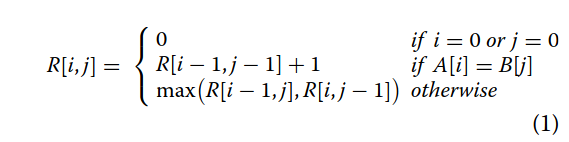
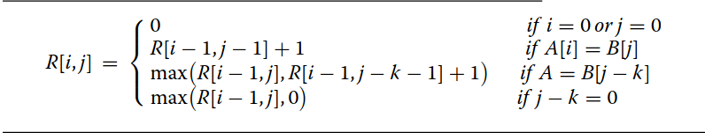
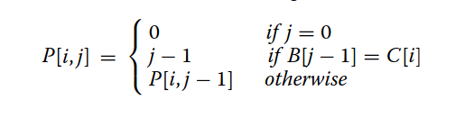

# Relatorio Trabalho 1 OpenMP
Aluno: Leonardo Bueno Nogueira Kruger
GRR20180130
## Introdução
## Funcionamento Core LCS
Algoritmo LCS (Longest Common Subsequence)
Algoritmo utilizado para encontrar a maior subsequencia presente em duas sequencias (Strings), uma subsequencia é caracteriza como uma sequencia que aparece na mesma ordem relativa mas não necessariamente continua.

O Algoritmo trabalha em cima de uma matriz de tamanho sizeA x sizeB onde sizeA é o tamanho da string A e sizeB é o tamanho da string B, com a primeira linha e coluna inicializadas em 0.
```C
for (j = 0; j < (sizeA + 1); j++)
		scoreMatrix[0][j] = 0;

for (i = 1; i < (sizeB + 1); i++)
    scoreMatrix[i][0] = 0;
```
A partir dessa estrutura ocorre o LCS sobre a matriz, percorrendo a matriz caso encontre um 'match' de character (char de seqA e seqB correspondem) é pego o valor na diagonal anterior e somado 1 para o tamanho da subsequencia, caso contrario é maior valor do campo superior(cima) ou anterior(esquerda), ao final teremos o valor da maior subsequencia.
```C
int LCS(mtype ** scoreMatrix, int sizeA, int sizeB, char * seqA, char *seqB) {
	int i, j;
	for (i = 1; i < sizeB + 1; i++) {
		for (j = 1; j < sizeA + 1; j++) {
			if (seqA[j - 1] == seqB[i - 1]) {
				/* if elements in both sequences match,
				 the corresponding score will be the score from
				 previous elements + 1*/
				scoreMatrix[i][j] = scoreMatrix[i - 1][j - 1] + 1;
			} else {
				/* else, pick the maximum value (score) from left and upper elements*/
				scoreMatrix[i][j] =max(scoreMatrix[i-1][j], scoreMatrix[i][j-1]);
			}
		}
	}
	return scoreMatrix[sizeB][sizeA];
}
```
## Estratégia de paralelização
A partir da estrutura core do LCS foi possivel observar uma dependencia de dados que impossibilitava a paralelização do código, a partir do aritgo [An OpenMP-based tool for finding longest
common subsequence in bioinformatics](https://bmcresnotes.biomedcentral.com/articles/10.1186/s13104-019-4256-6) que propõe soluções sobre problema, decidi por implementar a versão 1 proposta no artigo, Yang et al propõe o 'Row‑wise independent algorithm' uma solução diferente das tradicionais anti-diagonal e bit-parallel e a escolha para o meu trabalho.
O algoritmo consiste na modificação da equação tradicional do LCS:



Pela versão 'Row-wise':

Onde k é o numero de passos necessarios para encontrar uma match como seqA[i] == seqB[j-k] ou j-k == 0, para isso é utilizada outra matriz on calculamos os valores de j-k para toda iteração i, dado por:

```C
mtype lcs_yang_v1(mtype **DP, mtype **P, char *A, char *B, char *C, int m, int n, int u)
{
	{

		for (int i = 1; i < m + 1; i++)
		{
			int c_i = get_index_of_character(C, A[i - 1], u);

#pragma omp parallel for schedule(static)
			for (int j = 0; j < n + 1; j++)
			{
				if (A[i - 1] == B[j - 1])
				{
					DP[i][j] = DP[i - 1][j - 1] + 1;
				}
				else if (P[c_i][j] == 0)
				{
					DP[i][j] = max(DP[i - 1][j], 0);
				}
				else
				{
					DP[i][j] = max(DP[i - 1][j], DP[i - 1][P[c_i][j] - 1] + 1);
				}
			}
		}
	}
	return DP[m][n];
}
```
```C
void calc_P_matrix_v1(mtype **P, char *b, int len_b, char *c, int len_c)
{
#pragma omp parallel for
	for (int i = 0; i < len_c; i++)
	{
		for (int j = 2; j < len_b + 1; j++)
		{
			if (b[j - 2] == c[i]) // j-2 as b we assume here that b has a empty character in the beginning
			{
				P[i][j] = j - 1;
			}
			else
			{
				P[i][j] = P[i][j - 1];
			}
		}
	}
}
```
## Informações e Metologia de testes
| Informação           | Descrição                                                                                                   |
| -------------------- | ----------------------------------------------------------------------------------------------------------- |
| S.O/kernel           | Ubuntu 5.15.0-43-generic #46~20.04.1-Ubuntu SMP Thu Jul 14 15:20:17 UTC 2022 x86_64 x86_64 x86_64 GNU/Linux |
| versão do compilador | gcc (Ubuntu 9.4.0-1ubuntu1~20.04.1) 9.4.0                                                                   |
| Flags de compilação  | -O3 -Wall -pedantic -pthread -fopenmp                                                                       |
| Processador          | Intel(R) Core(TM) i3-9100F CPU @ 3.60GHz                                                                    |
| Número de execuções  | 30                                                                                                          |

## Resultados
| em segs       | Serial   | 1 Thread | 2 Thread | 4 Thread |
| ------------- | -------- | -------- | -------- | -------- |
| Média 10k:    | 0,17669  | 0,16903  | 0,09683  | 0,070976 |
| Desv Pad 10k: | 0,00188  | 0,00275  | 0,00509  | 0,02414  |
| Média 20k:    | 0,700294 | 0,650065 | 0,355678 | 0,207929 |
| Desv Pad 20k: | 0,00453  | 0,00914  | 0,00535  | 0,04439  |
| Média 30k:    | 1,594543 | 1,44017  | 0,777968 | 0,521799 |
| Desv Pad 30k: | 0,00935  | 0,01746  | 0,01501  | 0,18416  |
